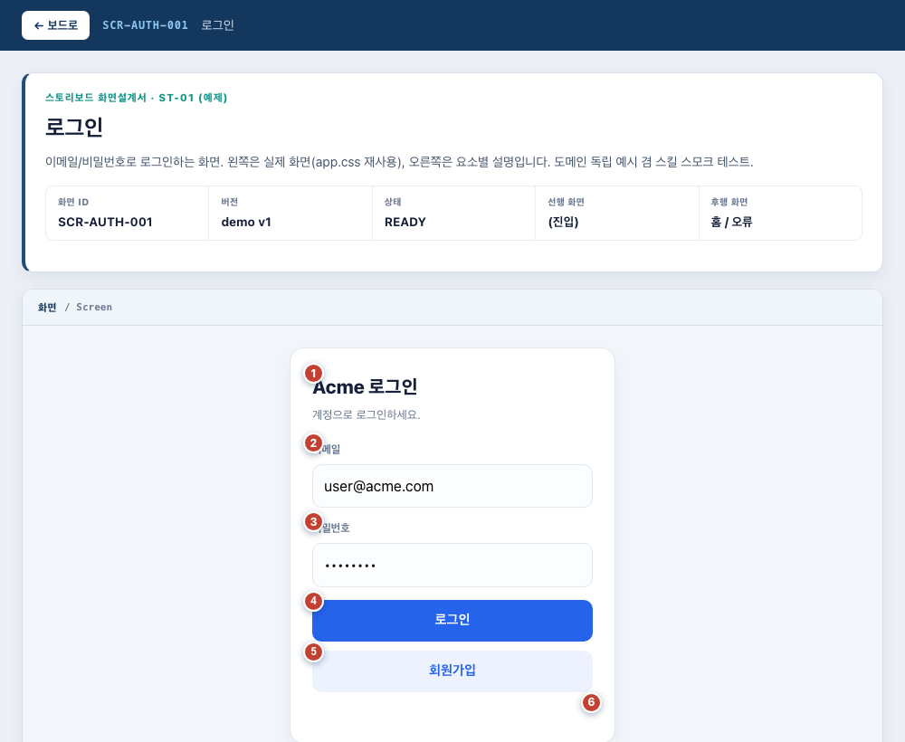

# storyboard-spec

> A reusable [Claude Code](https://claude.ai/code) **Skill** that generates side-by-side **storyboard-style screen design documents** (스토리보드식 화면설계서) — the kind 기획자/PM hand to both non-developers and API developers.

한 화면 = 한 페이지. **왼쪽은 화면 + 번호 콜아웃**, **오른쪽은 요소별 설명표(동작·데이터·예외)**. 그리고 썸네일 미리보기 **보드(index)** 가 각 화면으로 링크됩니다.

두 가지 모드로 쓸 수 있습니다 — **모드 B(기획)**: 화면이 아직 없을 때 와이어프레임으로 설계 / **모드 A(문서화)**: 이미 구현된·Figma 화면을 픽셀까지 재현. 이 스킬은 **화면설계 산출물 생성기**이지 Figma 임포터가 아닙니다(Figma는 모드 A의 한 입력). 도메인에 종속되지 않아 어떤 앱/기획에도 재사용할 수 있습니다.



## 무엇을 만드나 / What it produces

- **LEFT — 화면**: 모드 B는 와이어프레임으로 설계, 모드 A는 대상 앱의 진짜 CSS(또는 Figma export)로 재현 — 그 위에 번호 콜아웃(①②③…)을 얹습니다.
- **RIGHT — 화면 설명**: 콜아웃 1:1 대응 설명표 — 요소/DOM id, 동작·이벤트, 데이터 계약(필드·엔드포인트·공식), 상태, 예외.
- **BOARD — index.html**: 화면 미리보기 썸네일 카드 → 클릭하면 해당 스토리보드가 별도 화면으로 열림.

비개발자용 개요와 API 개발용 계약을 한 문서에 같이 담는 게 핵심입니다.

## 설치 / Install

**Claude Code** 와 **Codex** 둘 다, **macOS · Linux · Windows** 모두 지원합니다 (같은 `SKILL.md`).

```bash
# macOS / Linux / Windows(Git Bash·WSL)
git clone https://github.com/cskwork/storyboard-spec.git
cd storyboard-spec
./install.sh           # 설치된 런타임 모두 (~/.claude/skills, ~/.codex/skills)
./install.sh claude    # Claude Code 만   ·   ./install.sh codex   # Codex 만
```

```powershell
# Windows (네이티브 PowerShell)
git clone https://github.com/cskwork/storyboard-spec.git
cd storyboard-spec
.\install.ps1          # 양쪽   ·   .\install.ps1 claude   ·   .\install.ps1 codex
```

스킬 디렉토리에 바로 클론해도 됩니다:
`git clone … ~/.claude/skills/storyboard-spec` 또는 `… ~/.codex/skills/storyboard-spec`.

> 스크린샷 검증은 헤드리스 Chrome/Edge 가 필요합니다. macOS/Linux/Git Bash/WSL → `scripts/shoot.sh`, 네이티브 Windows → `scripts/shoot.ps1`. 둘 다 Chrome→Edge 순으로 자동 탐지하며 `CHROME` 환경변수로 직접 지정 가능합니다.

## 사용 / Usage

Claude Code / Codex 에서 그냥 요청하면 스킬이 발동합니다:

- (기획·모드 B) "아직 화면 없음 — 로그인·결제 플로우를 와이어프레임 스토리보드로 설계해줘"
- (문서화·모드 A) "구현된 이 화면들(또는 이 Figma)을 **화면설계서**(스토리보드)로 만들어줘"
- "`<app>/design-specs/` 에 로그인·결제 화면 스토리보드 만들어"
- 또는 슬래시: `/storyboard-spec`

Claude 가 요소를 정리 → 왼쪽 화면을 만들고(와이어프레임 또는 실제 CSS 재현) → 콜아웃 + 설명표 작성 → 보드 생성 → 헤드리스 크롬으로 스크린샷 검증까지 수행합니다.

## Figma 자동화 (모드 A) / One command from Figma

Figma 파일이 소스면 `scripts/figma_storyboard.py` 가 전 과정을 자동화합니다 — 프레임 하나 = 한 페이지:

```bash
export FIGMA_TOKEN=figd_...        # 또는 스킬 폴더의 .env (gitignored)
export FIGMA_FILE_KEY=xxxxxxxx     # 파일 URL의 /design/<KEY>/ 부분
python3 scripts/figma_storyboard.py --out ./design-specs --pages 9:2,60:2 --title "My CMS"
# --pages 생략 시 전체 캔버스 페이지. URL의 node-id 9-2 == API id 9:2
```

- **왼쪽 = 화면 이미지** — 프레임을 export 해 우측 설명 영역·하단 정책을 잘라낸 화면만, 그 위에 **선명한 HTML 콜아웃**(Figma 마커 좌표로 핀 — 이미지에 박지 않아 어느 배율에서도 또렷, 진하기 조절 가능).
- **오른쪽 = 설명, 아래 = 정책·규칙** — `DescriptionPanel`이 있으면 그 프레임을 쓰고, 없으면 우측 `TEXT` column을 감지해 **실제 HTML 텍스트**로 옮깁니다(선택·복사·검색 가능, 캡처 이미지 아님). 번호는 화면 콜아웃과 1:1 매칭되는 배지.
- **콜아웃 추출** — ELLIPSE+숫자 marker를 우선 사용하고, Figma가 marker를 TEXT group으로 만든 경우에는 `description_`/`point`/`marker` 같은 marker group + 흰색 bold 또는 빨간 marker fill인 텍스트만 허용합니다. 목록 개수·표 값 같은 일반 숫자 데이터는 콜아웃으로 승격하지 않습니다.
- **읽기 좋은 뷰어** — 좌측 목차로 화면 간 바로 이동, 화면 휠·버튼·드래그 줌, 원본 보기 인페이지 팝업(역시 줌), 우측 상단 글자 크기·콜아웃 진하기 컨트롤(한 페이지에서 바꾸면 `localStorage`로 전체 공통 적용).

함정(렌더 타임아웃, 패널/정책 분리, 숫자 데이터와 marker 구분, Grid `min-width:0`)과 단계는 [`reference/figma-extract.md`](reference/figma-extract.md).

## 구조 / Layout

```
storyboard-spec/
├── SKILL.md                     # 스킬 진입점 (Claude 가 읽음)
├── templates/
│   ├── storyboard.css           # chrome (콜아웃·설명표) + Figma 레이아웃·컨트롤·줌·라이트박스. :root 변수로 테마
│   ├── storyboard-page.html     # 화면 1장 스켈레톤 ({{placeholder}}) — 수작업 모드 B/A
│   ├── board-index.html         # 썸네일 보드 스켈레톤
│   ├── storyboard-figma-page.html / board-figma-index.html   # Figma 자동화용 페이지·보드
│   ├── settings-control.html/.js # 글자 크기 + 콜아웃 진하기 (공통, localStorage 공유)
│   ├── zoom-control.js           # 화면 휠·버튼·드래그 줌
│   └── lightbox.html/.js         # 원본 보기 인페이지 팝업 뷰어
├── scripts/
│   ├── shoot.sh                 # 헤드리스 크롬 썸네일/검증 샷
│   └── figma_storyboard.py      # Figma 파일 → 스토리보드 사이트 한 줄 자동화
├── reference/
│   ├── playbook.md              # 전체 프로세스 · 함정 · 도메인 이식 가이드
│   └── figma-extract.md         # Figma REST 추출 워크플로 (텍스트→HTML, 콜아웃 오버레이, 함정)
└── examples/demo/               # 최소 동작 예제(로그인 화면) = 스모크 테스트
```

## 핵심 함정 (실전에서 깨졌던 것) / Gotchas

이 스킬이 값진 이유는 실제로 겪은 함정을 코드에 박아뒀기 때문입니다:

1. **콜아웃이 대상 앱 규칙에 덮어써짐** — 대상 CSS의 `.field span{display:block}`, `.meter span{background}` 같은 규칙이 콜아웃 `<span>`을 사각형/왼쪽정렬로 깨뜨립니다. → `storyboard.css`의 `.sb-cue`가 `!important`로 방어 (지우지 말 것).
2. **`<table>` 직속 `<span>` 금지** — 브라우저가 테이블 밖으로 밀어냅니다(foster parenting). → `<table>`을 `<div class="sb-mark">`로 감싸고 콜아웃을 그 div에.
3. **Figma 숫자 오인식** — 화면 안의 개수·점수·표 값도 숫자라서 단순 정규식으로 marker를 찾으면 잘못된 빨간 원이 생깁니다. → marker group/path와 fill/font 조건을 같이 봅니다.
4. **CSS 링크 순서** — 대상 앱 CSS 먼저, `storyboard.css` 나중.
5. **스크린샷으로 검증** 후 완료 선언.

자세한 내용은 [`reference/playbook.md`](reference/playbook.md).

## 도메인 이식 / Cross-domain

웹뿐 아니라 모바일/네이티브(스크린샷 위에 절대좌표 콜아웃), 프레임워크 앱(정적 렌더 후 CSS 링크), Figma 소스(MCP가 없으면 `figma-cli`로 `inspect --json`·`export` 추출 → [`reference/playbook.md`](reference/playbook.md) §8)로 확장 가능. `storyboard.css`의 `:root --sb-*` 변수만 바꾸면 브랜드 색에 맞출 수 있고, 템플릿의 한국어 라벨을 치환하면 영어 문서도 됩니다.

## License

MIT — see [LICENSE](LICENSE).
